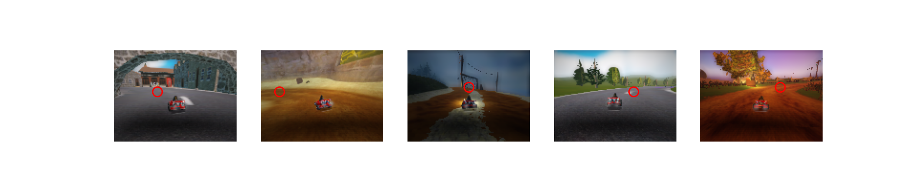
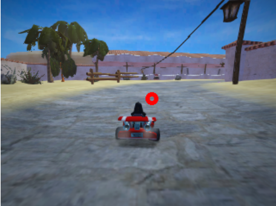

# <ins>HW4: SuperTuxKart</ins>

### <ins>Setup</ins>
In this homework, we will design a simple low-level controller that acts as an auto-pilot to 
drive in supertuxkart. In a later homework, we will use this auto-pilot to train a vision 
based driving system. To get started, first download and install SuperTuxKart on your 
machine. On a linux system, you can do this by writing

    pip install -U PySuperTuxKart

This command may fail because your system lacks other packages. You should then install 
those other packages. Once you have installed this, you should post about your experience on 
Piazza.

### <ins>Controller</ins>
Fill in the function control in the file [controller.py](homework/controller.py). The input of this function is an 
aim-point towards which the car should move, and the current velocity. The aim point uses 
screen coordinates: [−1, −1] is the top-left of the screen, [1, 1] is the bottom right.
What it should return is an action. You need to specify:
* `action.steer` the steering angle of the kart normalized to [−1, 1].
* `action.acceleration` the acceleration of the kart normalized to [0, 1].
* `action.brake` boolean indicator for braking.
* `action.drift` a special action that makes the kart drift, useful for tight turns.
* `action.nitro` burns nitro for fast acceleration.

Here are some hints. Note that this is one possible way to solve this, and you may do something totally different that works.
* Play around with setting a target velocity, and setting your acceleration to achieve that velocity.
* If the first entry of your aim point is negative, that means you want to turn left, since the target point is to the left of the center of the screen; and if the first entry of your aim point is positive, this means that you want to turn right.
* If your aim point is too far left or too far right, this means you are turning hard and should set the drift to True.

Once you are finished writing [controller.py](code/homework/controller.py), you should be able to test
your controller by writing:

    python3 -m homework.controller [TRACK_NAME] -v

For track name, plug in “zengarden”, “lighthouse,” “hacienda”, 
“snowtuxpeak”, “cornfield_crossing”, “scotland”. You should complete the 
first two under 50 seconds, the next two under 60 seconds, and the final 
two under 70 seconds. Note that the output will report the 
number of frames rather than seconds, and there are ten frames per 
second. These times are in-game times and will generally be less than 
the total computational runtime.

Grade your controller using:

    python3 -m grader homework

### <ins>Planner</ins>
In the second part, you will train a planner to predict the aim point. 
The planner takes as input an image and outputs the aim point in the 
image coordinate. Your controller then maps those aim points to actions.

### Data
Use your low-level controller to collect a training set for the planner.

    python3 -m homework.utils zengarden lighthouse hacienda snowtuxpeak cornfield_crossing scotland

We highly recommend you limit yourself to the above training levels, 
adding additional training levels may create an unbalanced training set 
and lead to issues with the final test_grader.

This function creates a dataset of images and corresponding aim points 
in drive_data . You can visualize the data using:

    python3 -m homework.visualize_data drive_data

Below are a few examples from the master-solution controller:

### Model
Implement your planner model in `Planner` class of [planner.py](homework/planner.py). Your planner model is a `torch.nn.Module` that takes as input an image tensor and outputs the aiming point in image coordinates (x: 0..127 , y: 0..95 ). We recommend using an encoder-decoder structure to predict a heatmap and extract the peak using a spatial argmax layer in [utils.py](homework/utils.py). Complete the training code in [train.py](homework/train) and train your model using: 

    python3 -m homework.train

### Vision-Based Driving
Once you completed everything, use:

    python3 -m homework.planner [TRACK_NAME] -v

to drive with your CNN planner and controller.

The red circle in the image below is being predicted using the trained master-solution planner network as a substitute for the ground truth aim point used previously.

Grade your planner using:

    python3 -m grader homework

